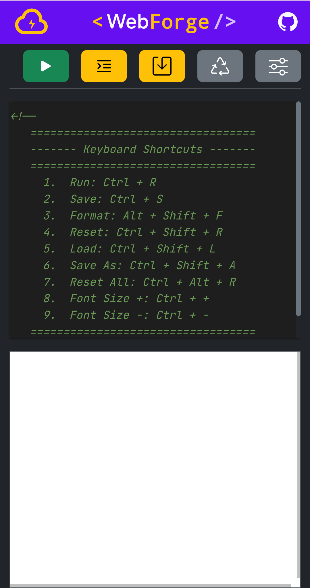
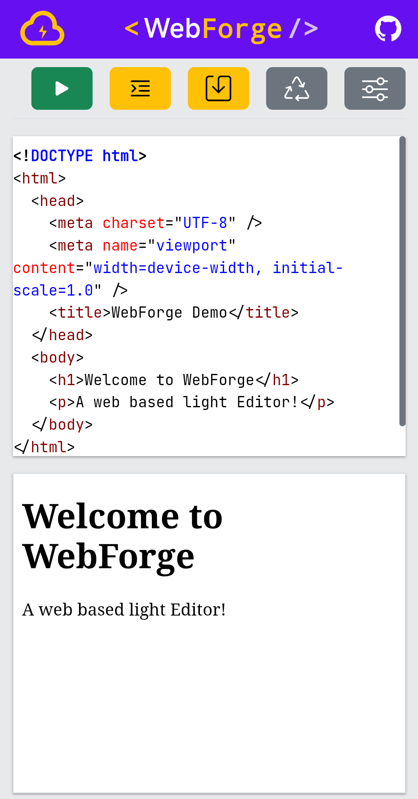

# WebForge

A lightweight in-browser HTML editor with live preview.

---

## 🔗 Live Demo

---

## 🚀 Features

-   Live HTML preview (sandboxed iframe)
-   Syntax highlighting (Prism.js)
-   Auto indent & Tab support
-   Code formatting (Prettier)
-   Theme switching (Light/Dark)
-   Font customization
-   Line numbers toggle
-   Word wrap toggle
-   Auto-run toggle
-   Keyboard shortcuts
-   Save to browser storage
-   Export as HTML file

---

## ⌨ Keyboard Shortcuts

| Action        | Shortcut           |
|---------------|--------------------|
| Run           | Ctrl + R           |
| Save          | Ctrl + S           |
| Format        | Alt + Shift + F    |
| Reset         | Ctrl + Shift + R   |
| Load          | Ctrl + Shift + L   |
| Save As       | Ctrl + Shift + A   |
| Reset All     | Ctrl + Alt + R     |
| Font Size +   | Ctrl + +           |
| Font Size -   | Ctrl + -           |

---

## 🔒 Security

Preview runs inside a sandboxed iframe

---

## 📦 Tech Stack

-   HTML
-   CSS
-   JavaScript
-   Prism.js
-   Prettier

---

## 📸 Screenshots

  
  

---

## 📌 Roadmap

-   v2.0.0 → Monaco Editor rewrite
-   Multi-tab support for HTML, CSS, JS
-   Console panel

---

## 📜 License

This project is licensed under the MIT License.

You are free to:
- Use
- Modify
- Distribute
- Use commercially

As long as the original license and copyright notice are included.

See the LICENSE file for full details.
