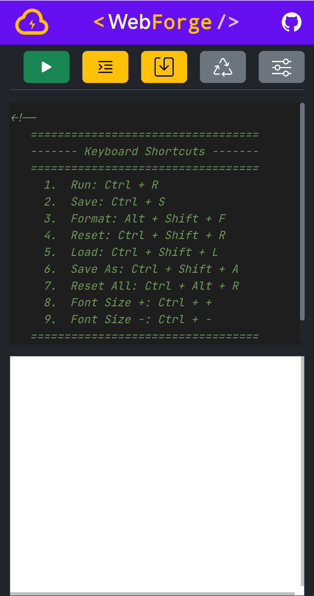
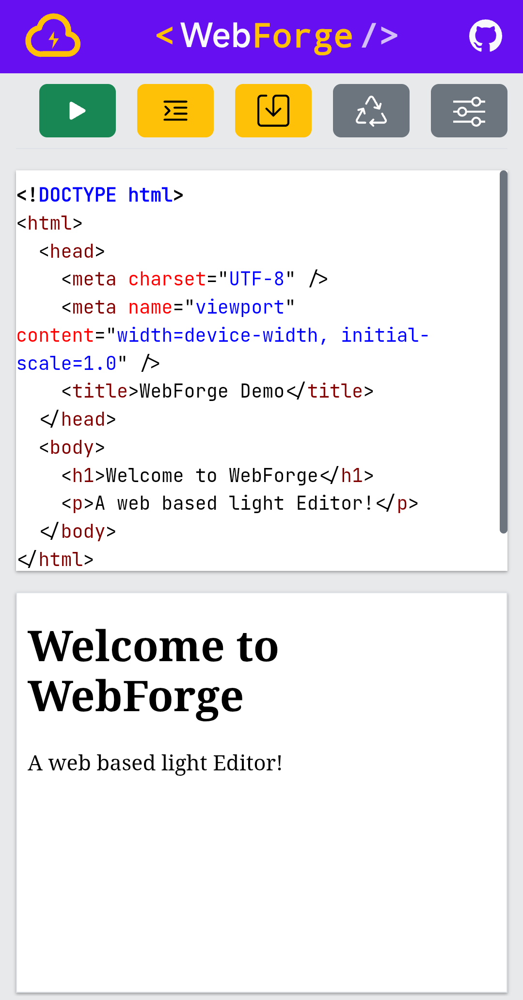

# WebForge

A lightweight HTML playground for mobile-first developers — powered by real browser rendering for predictable results.

---

## 🔗 Live Demo

---

## 🎯 Why WebForge?

WebForge was built to solve a real problem faced by mobile-first developers.

Many Android code editor apps rely on the system WebView, which can introduce
rendering inconsistencies such as font-size scaling differences, layout shifts,
and unpredictable alignment behavior.

This makes debugging HTML/CSS frustrating, especially when:
- The editor shows one size (e.g., 20px)
- The browser renders another (e.g., 16px)
- Constant switching between editor and browser is required

WebForge eliminates this friction by running directly inside the real mobile
browser with a sandboxed live preview. What you see is what the browser actually renders.

The goal is simple:
Fast, predictable snippet testing without heavy dependencies.

---

## 🚀 Features

-   Live HTML preview (sandboxed iframe)
-   Syntax highlighting (Prism.js)
-   Auto indent & Tab support
-   Emmet-style `! + Tab` HTML boilerplate generation
-   Code formatting (Prettier)
-   Theme switching (Light/Dark)
-   Font customization
-   Line numbers toggle
-   Word wrap toggle
-   Auto-run toggle
-   Keyboard shortcuts
-   Save to browser storage
-   Export as HTML file

---

## ⌨ Keyboard Shortcuts

| Action         | Shortcut           |
|----------------|--------------------|
| Run            | Ctrl + R           |
| Save           | Ctrl + S           |
| Format         | Alt + Shift + F    |
| Reset          | Ctrl + Shift + R   |
| Load           | Ctrl + Shift + L   |
| Save As        | Ctrl + Shift + A   |
| Reset All      | Ctrl + Alt + R     |
| Font Size +    | Ctrl + +           |
| Font Size -    | Ctrl + -           |
| HTML5 Template | ! + Tab            |

---

## 🔒 Security

Preview runs inside a sandboxed iframe

---

## 📦 Tech Stack

-   HTML
-   CSS
-   JavaScript
-   Prism.js
-   Prettier

---

## 📸 Screenshots

  
  

---

## 📌 Roadmap

-   v2.0.0 → Monaco Editor rewrite
-   Multi-tab support for HTML, CSS, JS
-   Console panel

---

## 📜 License

This project is licensed under the MIT License.

You are free to:
- Use
- Modify
- Distribute
- Use commercially

As long as the original license and copyright notice are included.

See the LICENSE file for full details.

---

## 🤝 Acknowledgements

WebForge was developed with the assistance of AI-powered development tools for guidance, debugging, and workflow support during development.

This project also leverages the following open-source libraries:

- Prism.js — Syntax highlighting
- Prettier — Code formatting
